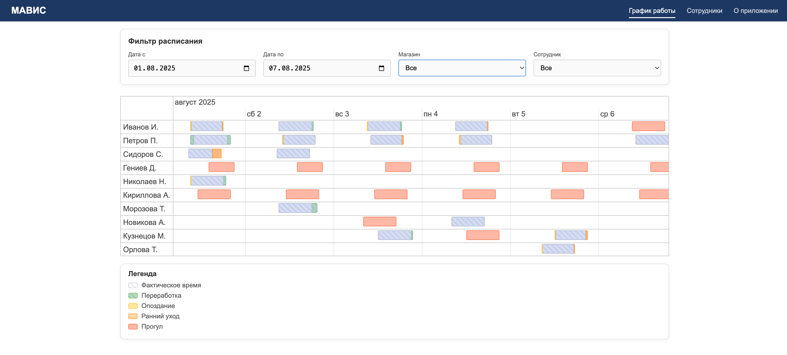

# Mavis Test Project — График работы сотрудников



## Задание:
На входе имеем: 2 набора данных (json):
План: {Сотрудник, Магазин, Роль, ДатаВремя_ПланС, ДатаВремя_ПланПо} Факт: {Сотрудник, Магазин, Роль, ДатаВремя_ФактС, ДатаВремя_ФактПо}
Необходимо сверстать расписание работы сотрудников. 
На графике отображено плановое время работы сотрудника (закрашенные прямоугольники) и фактическое (закрашено штриховкой). 
Для отображения графика можно использовать любой сторонний компонент.
На выходе ожидаем: html страницу + js + css + json-файл с данными.
БД & бэкэнд не требуются. Вёрстка должна быть адаптивная с поддержкой мобильных устройств.

Вариант Nº1. Облегченная задача (минимум):
• Отобразить план работы всех сотрудников;
• Фильтр: в диапазоне дат ограничиваем принудительно максимальную длительность - 4 дня (смен подряд у сотрудника);
• У одного сотрудника может быть несколько смен в выбранном фильтре дат в одном магазине, нужно отобразить оба отрезка в одной строке;
• При щелчке на смене сотрудника отображать плановую длительность этой смены.

Вариант Nº2. Задача нормальной сложности:
• Дополнительно к минимуму: отображать факт, прогулы, опоздания, ранние уходы;
• Максимальная длительность в фильтре не ограничена
 

## Описание проекта
Это прототип панели для управления расписанием сотрудников. Приложение позволяет:

- Отображать плановые и фактические смены сотрудников на интерактивном таймлайне
- Визуально видеть опоздания, ранние уходы, переработки и прогулы
- Фильтровать данные по дате, магазину и сотруднику
- Просматривать легенду с расшифровкой цветовых обозначений

Все данные хранятся в JSON-файле (`/data/schedule.json`).

## Функционал

- **Таймлайн** — плановые и фактические интервалы работы
- **Фильтры** — по диапазону дат, по магазину, по сотруднику
- **Цветовое выделение**:
  - Штриховка — факт
  - Жёлтый — опоздание
  - Оранжевый — ранний уход
  - Голубой/пунктир — переработка
  - Коралловый — прогул
- **Легенда** — поясняющие миниатюры под графиком
- **Адаптивный дизайн** — корректно отображается на мобильных

## Технологии

- **Next.js 15.4.5**  
- **React 19.1.0**  
- **vis-timeline 8.2.1**  
- **ESLint 9**

## Установка и запуск

1. Клонируйте репозиторий:
   ```bash
   git clone https://github.com/RainbowEclipsee/mavis-test-project.git
   cd mavis-test-project
   npm install
   npm run dev
